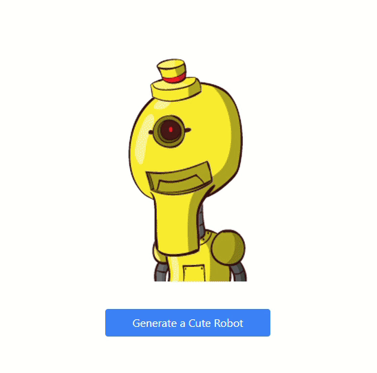

# React Robohash

React Robohash is a simple and fun random robot image generator website built with React, Tailwind, Flowbite, and the Robohash API. With just one click of a button, users can generate a totally random robot image and download it if they want.

## Technologies Used

- React
- Tailwind
- Flowbite
- Robohash API

## Demo

Check out the demo video to see React Robohash in action:

## Installation

To install the necessary dependencies, run the following command: `npm install`

## Usage

To start the development server, run the following command: `npm start`

## Contributing

Contributions are always welcome! Please read the [contributing guidelines](./CONTRIBUTING.md) before getting started.

## License

This project is just for fun, so no license is applicable.
